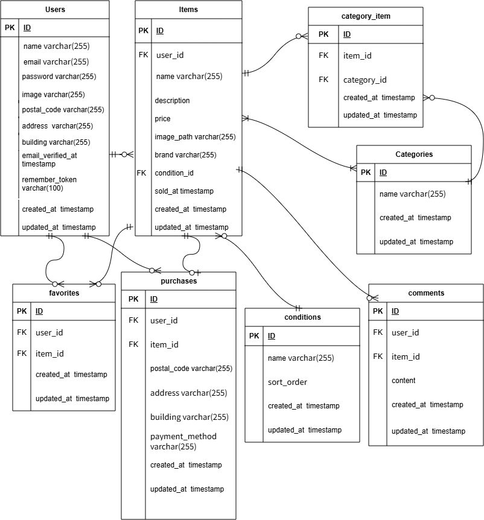

## Dockerビルド

- `git clone <git@github.com:crumin001-cmyk/test_marketplace.git>`
- `docker compose up -d --build`

## Laravel環境構築

- `docker compose exec php bash`
- `composer install`
- `cp .env.example .env`
- `.env`の環境変数を変更
- `php artisan key:generate`
- `php artisan migrate`
- `php artisan db:seed`

## 開発環境

- お問い合わせ画面：http://localhost/
- ユーザー登録：http://localhost/register
- phpMyAdmin：http://localhost:8080/
- MailHog：http://localhost:8025/

## 使用技術（実行環境）

- PHP 8.0
- Laravel 8.83.29
- MySQL 8.0.26
- Nginx 1.21.1
- Docker
- Docker Compose
- phpMyAdmin
- MailHog
- HTML
- CSS
- JavaScript

## ER図

